<p align="center">
  
</p>

<h1 align="center">Monitoring Infrastructure — Prometheus &amp; Grafana</h1>

<p align="center"><b>Scrape metrics, chart them, and get alerted.</b> A production-ready monitoring stack you can bring up with one command — Prometheus, Grafana and Alertmanager, pre-wired, with a dashboard and two example apps to learn from.</p>

<p align="center">
  
  
  
  <a href="LICENSE"></a>
</p>

---

## The idea

Instrument your apps to expose a `/metrics` endpoint. **Prometheus** scrapes those endpoints on a schedule, stores the numbers as time-series, and evaluates alert rules against them. **Grafana** charts the data, and **Alertmanager** routes any firing alerts to your inbox or chat. This repo wires all three together so you can see it working in minutes, then point it at your own services.

## What `docker compose up` brings up

<p align="center">
  
</p>

| Service | Port | What it does |
|---|---|---|
| **Prometheus** | `9090` | scrapes targets, stores time-series, evaluates alert rules |
| **Grafana** | `3000` | dashboards over the data — datasource + panels provisioned |
| **Alertmanager** | `9093` | routes and dedupes firing alerts to your receivers |
| **Node Exporter** | — | hardware and OS metrics |
| **cAdvisor** | — | per-container metrics |

## Quick start

```bash
git clone https://github.com/ry-ops/monitoring-infrastructure-prometheus-grafana.git
cd monitoring-infrastructure-prometheus-grafana

docker compose up -d
```

Then open:

- **Grafana** — http://localhost:3000 (`admin` / `admin` — change it on first login)
- **Prometheus** — http://localhost:9090
- **Alertmanager** — http://localhost:9093

The datasource and a **system-overview** dashboard are provisioned automatically, so Grafana has data the moment it starts.

**Prerequisites:** Docker + Docker Compose, and ~2GB RAM to spare.

## Project layout

```
docker-compose.yml
prometheus/
  prometheus.yml          # scrape targets
  alerts.yml              # alert rules (high CPU/memory, service down, low disk)
grafana/
  provisioning/
    datasources/          # points Grafana at Prometheus
    dashboards/           # auto-loads the dashboards below
  dashboards/             # system-overview.json
alertmanager/
  config.yml              # routing + receivers
examples/
  node-app/               # Node app exposing /metrics (prom-client)
  python-app/             # Python app exposing /metrics (prometheus_client)
```

## Monitor your own app

Point Prometheus at your service by adding a scrape target in `prometheus/prometheus.yml`:

```yaml
scrape_configs:
  - job_name: my-app
    static_configs:
      - targets: ["my-app:8080"]   # host:port exposing /metrics
```

…then instrument the app to expose metrics. The example apps show the pattern end to end:

```python
# Python — prometheus_client
from prometheus_client import Counter, Histogram, generate_latest
request_count = Counter("app_requests_total", "Total requests")
request_duration = Histogram("app_request_duration_seconds", "Request duration")
```

```javascript
// Node.js — prom-client
const client = require("prom-client");
const counter = new client.Counter({ name: "app_requests_total", help: "Total requests" });
```

Run either example on its own with `docker compose up -d` from inside `examples/node-app/` or `examples/python-app/`.

## Alerts

Rules live in `prometheus/alerts.yml` — high CPU, high memory, service down and low disk are included out of the box. When a rule fires, Prometheus hands it to Alertmanager, which dedupes and routes it to the receivers you configure in `alertmanager/config.yml`.

## Data retention

Prometheus keeps 15 days by default. To change it, edit the Prometheus command in `docker-compose.yml`:

```yaml
--storage.tsdb.retention.time=30d
```

## Before production

- Change the default Grafana password immediately.
- Put TLS in front of all three UIs and wire up real auth (OAuth, LDAP, …).
- Isolate the stack on its own network and keep the ports off the public internet.
- Move any secrets out of the config files into a secrets manager.

## Docs

- [Setup guide](documentation/SETUP.md)
- [Dashboard guide](documentation/DASHBOARDS.md)
- [Troubleshooting](documentation/TROUBLESHOOTING.md)
- Upstream: [Prometheus](https://prometheus.io/docs/) · [Grafana](https://grafana.com/docs/) · [PromQL](https://prometheus.io/docs/prometheus/latest/querying/basics/)

## License

MIT. See [LICENSE](LICENSE).

<!-- org-footer -->
---

<p align="center"><sub>Part of <a href="https://github.com/ry-ops">ry-ops</a> · building the pipes between infrastructure, automation, and observability · built by <a href="https://github.com/ry-ops">ry-ops</a></sub></p>
